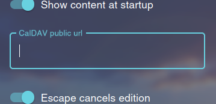
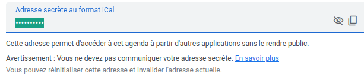
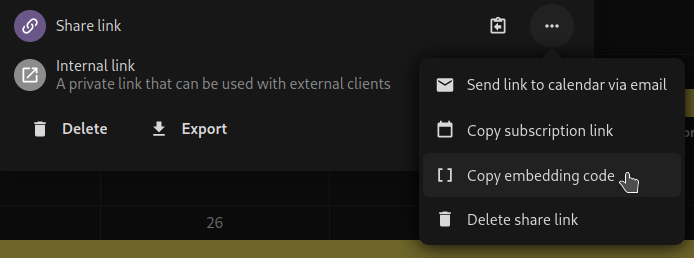
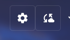

<!-- Improved compatibility of back to top link: See: https://github.com/othneildrew/Best-README-Template/pull/73 -->

<!--
*** Thanks for checking out the Best-README-Template. If you have a suggestion
*** that would make this better, please fork the repo and create a pull request
*** or simply open an issue with the tag "enhancement".
*** Don't forget to give the project a star!
*** Thanks again! Now go create something AMAZING! :D
-->

<!-- PROJECT SHIELDS -->
<!--
*** I'm using markdown "reference style" links for readability.
*** Reference links are enclosed in brackets [ ] instead of parentheses ( ).
*** See the bottom of this document for the declaration of the reference variables
*** for contributors-url, forks-url, etc. This is an optional, concise syntax you may use.
*** https://www.markdownguide.org/basic-syntax/#reference-style-links
-->
[![Contributors][contributors-shield]][contributors-url]
[![Forks][forks-shield]][forks-url]
[![Stargazers][stars-shield]][stars-url]
[![Issues][issues-shield]][issues-url]
[![license-shield]][license-url]

<!-- PROJECT LOGO -->
 

  <h3 align="center">Journal Startpage</h3>

  

    Provides a startpage with productivity tools!
     
     
    <a href="https://sapristi.github.io/journal-startpage/index.html">View Demo</a>
    ·
    <a href="https://github.com/sapristi/journal-startpage/issues">Report Bug</a>
    ·
    <a href="https://github.com/sapristi/journal-startpage/issues">Request Feature</a>
  

<!-- TABLE OF CONTENTS -->

  
Table of Contents

  <ol>
    <li>
      <a href="#about-the-project">About The Project</a>
    </li>
    <li>
      <a href="#installation">Installation</a>
    </li>
    <li><a href="#how-to-use">How to use</a></li>
    <li><a href="#roadmap">Roadmap</a></li>
    <li><a href="#develop">Develop</a></li>
    <li><a href="#contributing">Contributing</a></li>
    <li><a href="#license">License</a></li>
    <li><a href="#credits">Credits</a></li>

  </ol>

<!-- ABOUT THE PROJECT -->
## About The Project

![product-screenshot]

### Tools:
-   Journal
-   Notes (textual or tabular)
-   Tasks
-   Display calendar
-   Show bookmarks from selected folder
-   Show future events from a caldav public link

Global shortcuts allow for keyboard-first usage.

It uses your browser sync storage, so that your data is safely backed-up, and can be shared between computers.

(<a href="#readme-top">back to top</a>)

<!-- INSTALLATION -->
## Installation

| Firefox| Chrome|
|:---:|:---:|
| &nbsp;&nbsp;&nbsp;&nbsp;&nbsp;&nbsp; [Download](https://addons.mozilla.org/fr/firefox/addon/journal-startpage/) &nbsp;&nbsp;&nbsp;&nbsp;&nbsp; | &nbsp;&nbsp;&nbsp;&nbsp;&nbsp; [Download](https://chrome.google.com/webstore/detail/journal-startpage/bkafbgknnlmlmkhpbenogcjmcdhmieec) &nbsp;&nbsp;&nbsp;&nbsp;&nbsp; |

## How to use

### Basic usage

Create new notes / journal entries tasks.

To edit a field, double click on it. Once you are done editing:
- <kbd>Ctrl</kbd> + <kbd>Enter</kbd> will save your changes
- <kbd>Esc</kbd> will revert your changes (you can disable this in the settings, and make <kbd>Esc</kbd> save your changes as well).

### Browser sync

If you are using your browser with an account, then the data will also be synchronised with that account. This means the your notes will be available on other computers, if you are using the same browser account.

Note that:
- synchronisation is managed by the browser - every change may not always be synced immediatly.
- settings are not synchronised.

See:
- [firefox account](https://www.mozilla.org/firefox/accounts/)
- [chrome account](https://accounts.google.com/ServiceLogin?service=chromiumsync)

### Advanced topics

#### Display events

You can display incoming events of a given calendar by setting the public sharing URL for this calendar in the *CalDAV public url* setting field:

<table>
  <tr>
    <td>
      
    </td>
    <td>
      
    </td>
    <td>
      
    </td>
  </tr>
  <tr>
    <td>CaalDAV input</td>
    <td>Google calendar share link</td>
    <td>Nextcloud calendar share link</td>
  </tr>
</table>

#### NextCloud sync - experimental

NextCloud sync allows you to synchronise your notes with the [notes app](https://apps.nextcloud.com/apps/notes) of a NextCloud instance.

The feature is still incomplete, and a bit experimental:
- To enable, set the nextcloud host (e.g. `https://my-nexcloud.com`), username and password (you can generate a service account in your nextcloud security settings).
- The synchronisation button will then be available . Synchronisation is manual only.
- Synchronisation will:
  - create a note on NextCloud for each new note in the extension (with the category `journal-notes`)
  - when a note was already synchronised, the last modification will be synchronised (whether it comes from the extension or nextcloud)
  - a note deleted on nextcloud will be deleted in the extension
  - a note created on NextCloud will **not** be created in the extension
  - a note deleted on the extension will **not** be deleted in NextCloud

#### Permissions

In order to interact with external services (such as Google, NextCloud, etc), the extension needs permission to do so. When accessing a new service, a pop-up should appear requesting for "access to your data" - which is necessary to perform HTTP calls to this service. This extension only accesses the data necessary to provide the advertised features, and does not share anything with third parties.

**Important Note:** if a value for CalDAV url or nextCloud url was already set, you will need to remove it, then add it again, for the permission request to take effect.

<!-- ROADMAP -->
## Roadmap
- [x] Customize colors
- [x] Improve calendar display
- [x] Handle multiple open tabs: data is not overriden
- [x] Select locale
- [x] Search journal
- [x] Browser sync storage
- [x] Tabular notes
- [x] Bookmarks
- [x] Show events from calDAV calendar
- [ ] Short term:
  - [x] Display total space usage
  - [ ] Reorder tasks
  - [ ] Double click to delete entry

- [ ] Long term:
    - [ ] Trash bin
    - [ ] Sync data:
      - [ ] Notion ?
      - [x] Nextcloud notes ?
    - [ ] Rework journal:
      - [ ] Allow to change date ?
      - [ ] Integrate with calendar ?

See the [open issues](https://github.com/othneildrew/Best-README-Template/issues) for a full list of proposed features (and known issues).

(<a href="#readme-top">back to top</a>)

<!-- DEVELOP -->
## Develop

- `pnpm start` to run in develop mode (using localStorage instead of sync storage, because it cannot register as an extension this way)
- `pnpm build:dev` to build development version of the extension
- `pnpm build` to build the production assets

(<a href="#readme-top">back to top</a>)

<!-- CONTRIBUTING -->
## Contributing

Contributions are what make the open source community such an amazing place to learn, inspire, and create. Any contributions you make are **greatly appreciated**.

If you have a suggestion that would make this better, please fork the repo and create a pull request. You can also simply open an issue.
Don't forget to give the project a star! Thanks again!

1. Fork the Project
2. Create your Feature Branch (`git checkout -b feature/AmazingFeature`)
3. Commit your Changes (`git commit -m 'Add some AmazingFeature'`)
4. Push to the Branch (`git push origin feature/AmazingFeature`)
5. Open a Pull Request

(<a href="#readme-top">back to top</a>)

<!-- LICENSE -->
## License

Distributed under the GNU General Public License v3.0. See `LICENSE` for more information.

(<a href="#readme-top">back to top</a>)

<!-- CREDITS -->
## Credits

- Inspired by [Elegant New Tab](https://addons.mozilla.org/en-US/firefox/addon/elegant-startage-new-tab/)
- Default wallpaper from https://www.publicdomainpictures.net/fr/view-image.php?image=85030&picture=blue-sunset-wallpaper
- Readme template: https://github.com/othneildrew/Best-README-Template

(<a href="#readme-top">back to top</a>)

<!-- MARKDOWN LINKS & IMAGES -->
<!-- https://www.markdownguide.org/basic-syntax/#reference-style-links -->
[contributors-shield]: https://img.shields.io/github/contributors/sapristi/journal-startpage.svg?style=for-the-badge
[contributors-url]: https://github.com/sapristi/journal-startpage/graphs/contributors
[forks-shield]: https://img.shields.io/github/forks/sapristi/journal-startpage.svg?style=for-the-badge
[forks-url]: https://github.com/sapristi/journal-startpage/network/members
[stars-shield]: https://img.shields.io/github/stars/sapristi/journal-startpage.svg?style=for-the-badge
[stars-url]: https://github.com/sapristi/journal-startpage/stargazers
[issues-shield]: https://img.shields.io/github/issues/sapristi/journal-startpage.svg?style=for-the-badge
[issues-url]: https://github.com/sapristi/journal-startpage/issues
[license-shield]: https://img.shields.io/github/license/sapristi/journal-startpage.svg?style=for-the-badge
[license-url]: https://github.com/sapristi/journal-startpage/blob/master/LICENSE
[product-screenshot]: ./assets/screenshot.png
